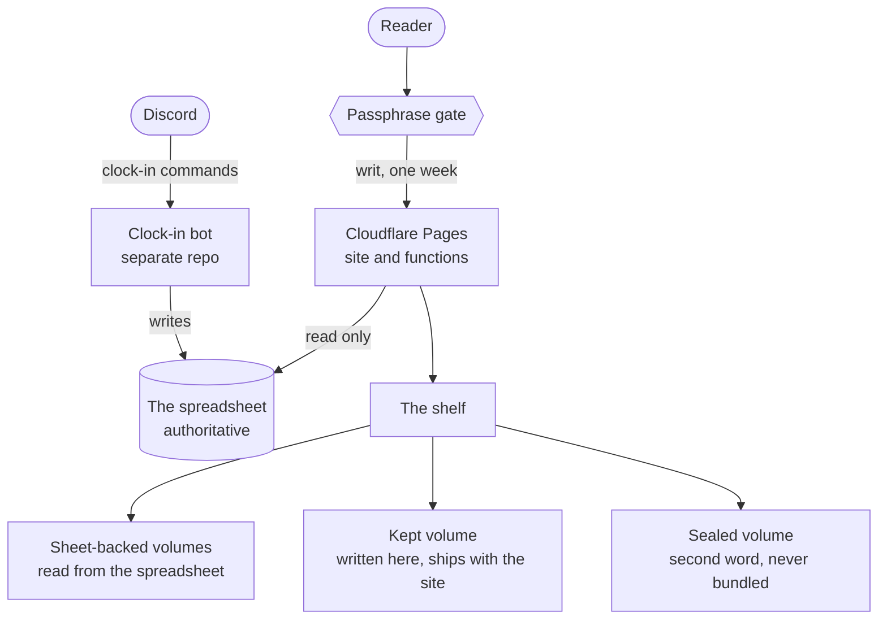

# Thalmor Embassy Archives

A gated, read-only web archive that renders a roleplay community's records as
in-world ceremonial registers — a shelf of bound volumes you open and read,
rather than a spreadsheet with a theme on it.

Live at **[thalmor-archives.pages.dev](https://thalmor-archives.pages.dev)**.
It is deliberately `noindex, nofollow`: the registers carry about a hundred real
people's handles and activity, so the archive is for members, not for search
engines.

---

## Reading the archive

### Getting in

The archive opens to a wax seal and asks for a word. That word is handed out by
the Embassy — it is not in this repository and never will be. One word admits
you to the whole shelf and is remembered for a week.

### The shelf

Eight volumes stand in the hall, grouped by what they hold. Each is painted art
with its title lettered live, so a book is opened by clicking it. A volume whose
source has gone missing stays on the shelf marked **withdrawn** rather than
disappearing or breaking the page.

### Inside a volume

Registers — the roster, the statistics, the ledger, the stipends, the hall of
honor — open as parchment pages: summary figures at the top, then the record
itself. On a narrow screen the wide tables become cards rather than scrolling
sideways.

**The Tamrielic Calendar** keeps the realm's own time. A sand clock beside the
date shows how far the day has run — the upper bulb drains from midnight to
midnight — and the clock advances by itself. Today's date is ringed in the year
grid. **Tap or click any marked day** to read what falls on it; the note opens
in a panel pinned to the foot of the screen, which is how it works on a phone
as well as under a mouse.

**The Thalmor Chronicles** is sealed a second time and asks for a word of its
own. Inside, it is bound as a book rather than laid out as a page: two leaves
facing each other, a leaf that turns, and your place kept as you go. Arrow keys
turn it, narrow screens show one leaf at a time, and readers who ask for less
motion get the same pages without the turn.

Two aids sit above that volume:

- **Scrying** — search the whole chronicle. Every hit is lit where it sits, and
  choosing one turns the book to the leaf that holds it.
- **Guided reading** — bionic reading, which sets the opening of each word in
  bold so the eye has somewhere to land. Off unless you ask for it, and
  remembered once you do.

---

## Architecture

The community's spreadsheet is the source of truth. A **separate** clock-in bot
writes to it; this archive only ever reads, and holds a read-only scope so a bug
here cannot reach the bot's columns.



Four things that shape everything else:

- **The gate is the boundary, not the page.** Every data route is checked
  server-side, and gated answers are marked so no shared cache can hand one
  reader's roster to someone with no cookie.
- **Three kinds of volume.** Most are read from the spreadsheet. One is written
  here and travels with the site. One is *sealed* — its text is served only
  after a second word and is never compiled into the browser bundle, because
  anything in the bundle is readable by anyone with the link.
- **One origin.** Site and data are deployed together, so there is no CORS and
  no second service to keep in step.
- **Assets are built, not hand-cropped.** The covers are cut, re-bound and
  lettered by a committed script from the delivered art, so the result is
  reproducible rather than a folder of one-off exports.

---

## Layout

| Directory | What it is |
|---|---|
| [`web/`](web/) | The archive itself — shelf, volumes, styling. |
| [`shared/`](shared/) | The volume registry, parsers and reckoning. Pure, used by both halves. |
| [`server/`](server/) | Reads the spreadsheet and parses it. |
| [`functions/`](functions/) | The gate and the data routes. |
| [`scripts/`](scripts/) | Asset preparation. Committed script, committed output. |
| [`test/`](test/) | Vitest — parsers, the calendar's reckoning, the statistics, the palette. |
| [`docs/`](docs/) | Research notes and the transcribed press history. |

---

## Running it

Node is pinned in [`.nvmrc`](.nvmrc) so the toolchain the clock-in bot shares is
left alone.

```bash
npm install
npm run dev        # the archive, with data proxied from the local functions
npm test           # unit tests
npm run typecheck  # both TypeScript projects, browser and worker
```

Configuration, deployment and the asset pipeline are documented in
[CLAUDE.md](CLAUDE.md), along with the invariants a change here must not break.
Nothing needed to run the archive against real data is in this repository, and
nothing that would open it should ever be committed.

---

## Status

The archive is built and live. It is read-only by design; there is no write path
back to the spreadsheet and there should not be one.
