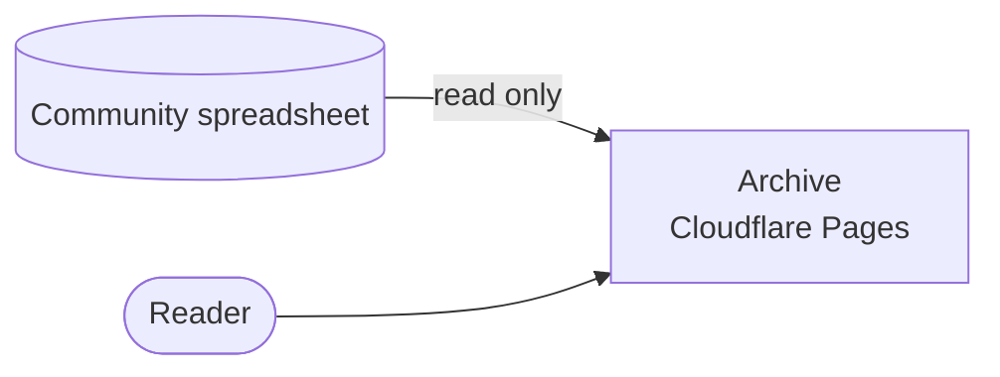

# Thalmor Embassy Archives

[](https://github.com/Mosalah992/Centralized-Dossier/actions/workflows/ci.yml)

A web archive for a roleplay community. Its records are presented as in-world
ceremonial registers: a hall of bound volumes you open and read, not a
spreadsheet with a theme on it.

Live at **[thalmor-archives.com](https://thalmor-archives.com)**.

---

## What it offers

- **The hall.** A torch-lit front page with the Embassy's seal, its statement of
  purpose, a portrait, a film and a gallery of the Embassy at work.
- **Recruitment.** The Dominion's terms for applicants and a link to the
  application form.
- **The registers.** Each volume opens as parchment pages, with summary figures
  first and the record beneath. Wide tables become cards on a phone.
- **The Tamrielic Calendar.** It keeps the realm's own time, with a sand clock
  that drains through the day and notes you can open on any marked date.
- **Sealed volumes.** Some records are held back behind their own in-world
  gates. Their contents are never shipped to the browser or kept in this
  repository.
- **Reading aids.** Search within a volume, an optional bionic-reading mode, full
  keyboard navigation, and a reduced-motion experience for readers who ask for
  one.

---

## How it is built

The community's spreadsheet is the source of truth. This archive only reads it;
it never writes back.


```mermaid
flowchart LR
    Sheet[(Community spreadsheet)] -->|read only| Site[Archive<br/>Cloudflare Pages]
    Reader([Reader]) --> Site
```

| Layer | Choice |
|---|---|
| Front end | React 18, TypeScript, Vite 7, GSAP for motion |
| Hosting | Cloudflare Pages, with its server functions on the same origin |
| Type | Self-hosted Cinzel and EB Garamond |
| Tests | Vitest |

Principles the codebase holds to:

- **Read-only by design.** Nothing in the archive can change the records it
  displays.
- **No third parties.** No analytics, trackers, external fonts or CDNs. A
  reader's visit reaches no one but the archive.
- **Not indexed.** The archive is excluded from search engines.
- **Reproducible assets.** Covers, portraits and other art are produced by
  committed scripts from the source material, not hand-exported.
- **Accessible and calm.** Semantic structure, visible focus, reduced-motion
  support, and pages audited with axe.

---

## Quality

Every push and pull request is checked by CI from a clean clone: type checks,
the test suite, a production build, and a dependency audit. The site ships a
strict Content Security Policy and hardened response headers.

---

## Development

Node is pinned in [`.nvmrc`](.nvmrc).

```bash
npm install
npm run dev        # local development server
npm test           # test suite
npm run typecheck  # browser and server TypeScript projects
npm run build      # production build
```

A fresh clone builds and tests with placeholder content. The real records, and
the credentials to read them, are deliberately not in this repository and must
never be committed.

Contributors should start with [AGENTS.md](AGENTS.md), which holds the working
rules and the invariants a change must not break.

---

## Security

Please report suspected vulnerabilities privately through GitHub's **Security →
Report a vulnerability**, not in a public issue. The security model is described
in [SECURITY.md](SECURITY.md).
